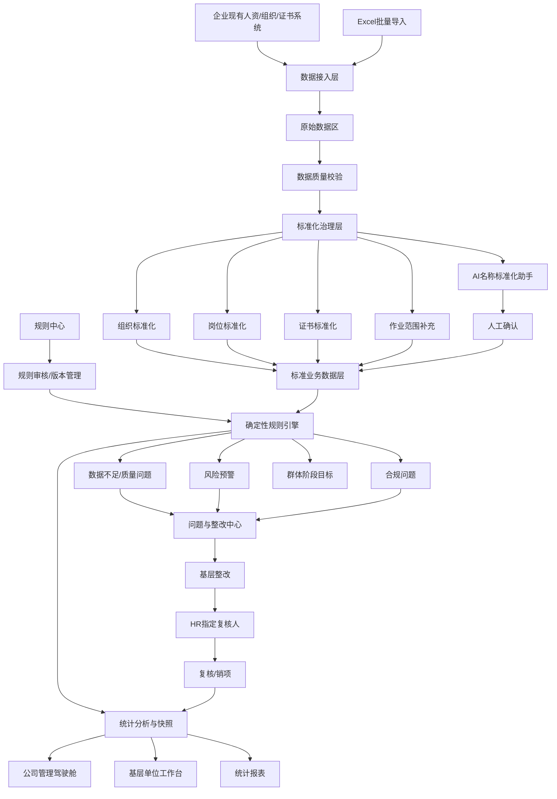
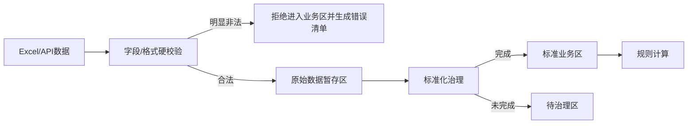
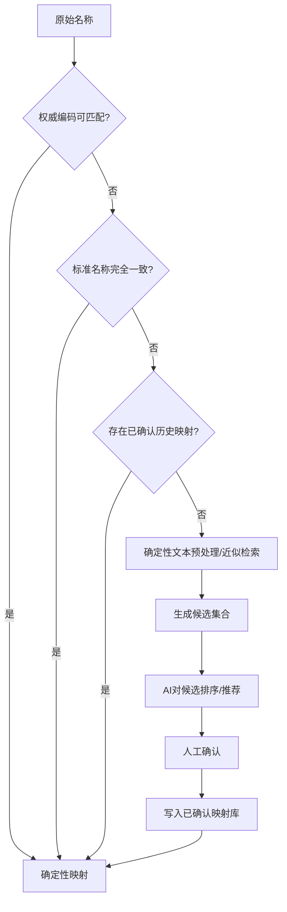
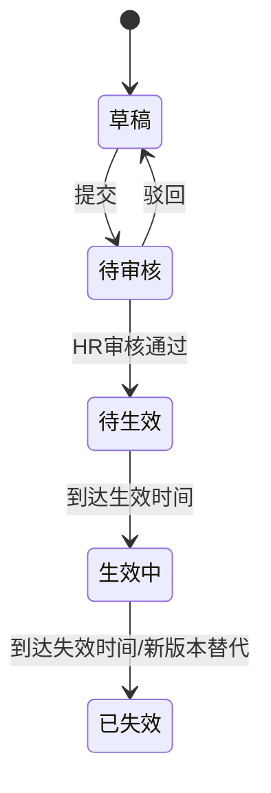
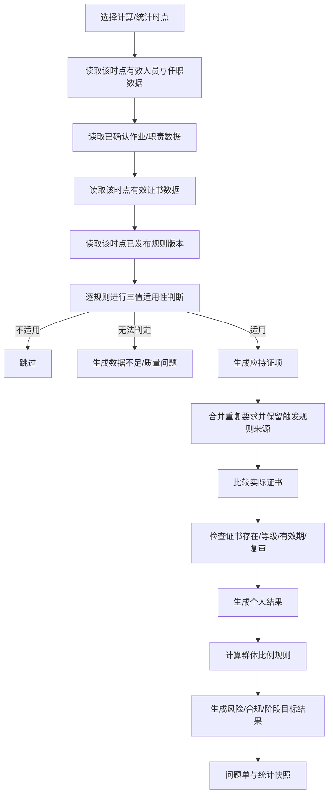
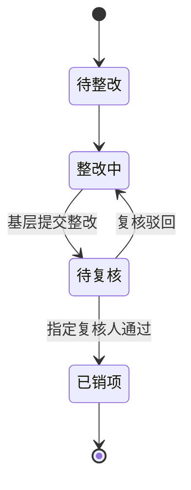

# 持证上岗统计分析系统完整实现方案

> 版本：方案讨论稿 V1.0  
> 适用目标：形成完整企业级架构，并实现可演示 MVP  
> 方案定位：管理端系统，不建设员工个人端  
> 核心原则：**安全、稳定、正确优先；可以暂时“不知道”，但不能“猜错”。**

---

## 1. 方案背景与建设目标

### 1.1 背景

依据《持证上岗统计分析系统任务书》及《关于进一步加强员工持证上岗管理的指导意见》，企业已明确国家管控类、集团管控类、激励提升类三类持证标准及相关持证范围、时间节点、考核与激励要求。

当前问题不是“企业完全没有人员、岗位和持证数据”，而是：

1. 人员、岗位、证书等数据分散在不同业务部门或系统；
2. 同一组织、岗位、证书在不同单位存在不同写法，统计口径不统一；
3. 岗位名称本身往往不足以确定持证要求，还需要结合实际作业范围或职责；
4. 缺少证书到期、复审、过渡期等自动预警；
5. 缺少可复现、可追溯的“人—岗—证”规则校验；
6. 数据不完整时，传统统计容易把“未知”误算成“合规”或“不合规”；
7. 整改过程依赖线下沟通，缺少问题发现、下发、整改、复核、销项的完整闭环；
8. 缺少按单位、专业、岗位、证书类别、时间等维度形成的统一统计分析结果。

### 1.2 建设目标

系统建设目标不是简单的“证书台账电子化”，而是建立以下完整闭环：

> **数据接入 → 数据治理 → 标准化 → 人岗证规则计算 → 合规校验 → 风险预警 → 问题整改 → 复核销项 → 统计分析 → 历史追溯**

系统应具备：

- 统一的数据标准；
- 可配置、可审批、可版本化的持证规则；
- 可解释的确定性规则计算；
- 数据不足时的安全退出机制；
- 多级证书预警；
- 闭环整改；
- 历史快照和规则历史回溯；
- 与现有人资、组织、证书、人才库等系统对接的扩展能力；
- AI 名称标准化辅助能力，但 AI 不直接参与合规结论。

---

# 2. 设计原则

## 2.1 正确性优先

系统遵循：

> **宁可标记“未知、待确认、数据不足”，也不得根据不充分信息自行推断正式合规结论。**

尤其是生产岗位、特种作业、特种设备等持证要求，不能通过岗位名称相似、同班组其他人员情况或 AI 预测自动补全关键作业范围。

## 2.2 原始数据不覆盖

任何标准化、映射、补充和计算都不得覆盖原始业务值。

应同时保留：

- 原始组织名称；
- 原始岗位名称；
- 原始证书名称；
- 原始来源；
- 导入批次；
- 标准化结果；
- 标准化依据；
- 确认人和确认时间。

由此保证每个统计结论均可追溯至原始依据。

## 2.3 规则与数据分离

持证要求不得硬编码在程序逻辑中。

系统采用：

> **标准业务数据 + 已发布规则版本 → 确定性校验结果**

证书类型、持证范围、阶段比例、过渡期、预警时间等变化应尽可能通过配置完成，而非修改底层代码。

## 2.4 AI 只做辅助，不做裁决

AI 仅用于**名称标准化候选推荐**。

AI 不允许：

- 判断某人是否应该持证；
- 判断是否合规；
- 自动补全作业范围；
- 自动发布规则；
- 自动解决制度冲突；
- 自动销项整改；
- 自动修改权威主数据。

## 2.5 全过程可追溯

系统必须能够回答：

- 数据从哪里来？
- 原始值是什么？
- 为什么映射成这个标准值？
- 谁确认的？
- 当时生效的是哪一版规则？
- 为什么系统判定为合规/不合规/无法判定？
- 问题由谁整改、谁复核、何时销项？

---

# 3. 总体架构

## 3.1 总体逻辑架构



## 3.2 分层架构

### 第一层：数据接入层

负责：

- Excel 批量导入；
- 网页单条维护；
- 未来 API/数据交换接口；
- 数据来源、批次、时间范围记录。

### 第二层：数据治理与标准化层

负责：

- 数据格式和完整性检查；
- 非法数据阻断；
- 组织、岗位、证书名称标准化；
- AI 候选推荐；
- 人工确认；
- 缺失作业范围补充。

### 第三层：标准业务数据层

保存可参与计算的：

- 组织；
- 人员；
- 岗位；
- 任职历史；
- 作业/职责属性；
- 标准证书；
- 人员实际持证记录。

### 第四层：规则与计算层

包括：

- 持证规则中心；
- 规则审批；
- 规则版本；
- 规则冲突检测；
- 个人规则计算；
- 群体比例计算；
- 过渡期计算；
- 新上岗时间条件计算；
- 证书有效期及等级判断。

### 第五层：风险与闭环管理层

包括：

- 数据质量问题；
- 风险预警；
- 合规问题；
- 问题下发；
- 整改；
- HR 指定复核人；
- 复核；
- 销项；
- 逾期跟踪。

### 第六层：统计分析与应用层

包括：

- 公司管理驾驶舱；
- 基层单位工作台；
- 核心统计报表；
- 历史快照；
- 趋势分析；
- 单位/专业/岗位/证书多维下钻。

---

# 4. 核心业务对象设计

## 4.1 组织机构

组织模型不固定为“公司—部门—班组”三层，采用通用树结构。

核心属性：

- 组织 ID；
- 上级组织 ID；
- 组织编码；
- 组织类型；
- 标准名称；
- 原始名称；
- 生效时间；
- 失效时间；
- 状态。

优先使用企业权威组织编码识别组织。名称仅作为补充识别依据。

## 4.2 人员主档

系统内部生成不可变的人员 ID。

人员唯一识别建议：

1. 工号优先；
2. 必要时使用身份证号辅助校验；
3. 身份证号属于敏感数据，应加密、脱敏并限制使用；
4. 各业务关系表使用内部人员 ID，不直接使用身份证号作为主键。

核心属性：

- 人员 ID；
- 工号；
- 姓名；
- 身份证号（受控）；
- 在职状态；
- 数据来源。

## 4.3 人员任职历史

人员与岗位不能简单作为人员表中的一个静态字段。

应保留：

- 人员；
- 所属组织；
- 原始岗位；
- 标准岗位；
- 主岗/兼岗；
- 任职开始时间；
- 任职结束时间；
- 数据来源。

这使系统可以正确处理调岗、兼岗以及历史时点统计。

## 4.4 标准岗位库

标准岗位建议包含：

- 标准岗位 ID；
- 标准岗位名称；
- 专业；
- 岗位类别；
- 岗位序列；
- 是否生产岗位；
- 状态；
- 生效/失效时间。

原始岗位与标准岗位通过“岗位名称映射”关联，不覆盖源数据。

## 4.5 作业/职责标签

岗位名称本身不能完全决定持证要求，因此将“实际作业/职责范围”作为独立业务对象。

示例：

- 高压电气作业；
- 低压电气作业；
- 电力电缆作业；
- 继电保护作业；
- 电气试验；
- 高处作业；
- 起重司机；
- 起重指挥；
- 叉车操作；
- 氢系统操作；
- 有限空间作业；
- 特种设备安全管理；
- 专职安全监督；
- 技术监督专责；
- 其他经企业确认的职责标签。

人员—作业关系需保存：

- 数据来源；
- 是否已确认；
- 确认人；
- 确认时间；
- 生效/失效时间。

若企业已有该数据，直接接入；若缺失，由基层单位补充。

**系统不得根据岗位、班组或 AI 自动把候选作业范围写成正式作业范围。**

## 4.6 标准证书库

证书按制度分为：

- 国家管控类；
- 集团管控类；
- 激励提升类。

标准证书至少维护：

- 标准证书 ID；
- 标准证书名称；
- 类别；
- 子类；
- 证书系列；
- 等级；
- 等级序号；
- 是否存在有效期；
- 是否需要复审；
- 默认预警方案；
- 状态。

## 4.7 人员持证记录

包括：

- 人员 ID；
- 标准证书 ID；
- 原始证书名称；
- 证书编号；
- 发证机构；
- 取得日期；
- 有效开始日期；
- 有效截止日期；
- 复审日期；
- 注册状态；
- 当前有效状态；
- 来源系统/导入批次。

---

# 5. 数据导入与数据质量控制

## 5.1 基本思路

企业原有数据允许包含未标准化名称。

系统应区分：

> **导入成功 ≠ 标准化完成 ≠ 可参与正式统计**

## 5.2 四段式导入流程



### 第一阶段：硬校验

只判断数据是否具有基本合法性，不判断名称是否标准。

典型硬错误：

- 必填人员标识为空；
- 日期无法解析；
- 有效结束日期早于开始日期；
- 字段类型明显错误；
- 岗位名称字段为明显无意义纯数字；
- 明显非法控制字符或超长内容；
- 唯一标识发生无法解释的冲突。

硬校验采用字段级规则，不能简单规定“出现数字就是非法”。例如“1号机组”等业务名称可能合法。

### 第二阶段：原始数据暂存

例如以下内容都允许正常进入：

- “生技部”；
- “电修班”；
- “注安师”；
- “技术员（学习岗）”。

因为这些可能只是非标准数据，不等于非法数据。

### 第三阶段：标准化治理

进入组织、岗位、证书名称标准化流程，并对缺失的关键业务属性进行补充。

### 第四阶段：正式业务区

仅具备足够判定条件的数据进入规则计算。

关键标准字段未确认时：

- 保留人员和原始数据；
- 不擅自做持证结论；
- 纳入数据质量/待治理统计。

## 5.3 三种数据状态

| 数据状态 | 处理方式 |
|---|---|
| 非法数据 | 阻止进入正式业务区，生成导入错误清单 |
| 合法但未标准化 | 进入待治理区，等待映射或确认 |
| 合法且已标准化 | 进入标准业务区，可参与规则计算 |

## 5.4 部分成功导入

建议采用“逐行校验、部分成功”机制，而不是“一条错误整批失败”。

示例：

```text
导入记录：10,000

成功接收：9,962
├─ 已标准化：9,417
└─ 待治理：545

导入失败：38
├─ 岗位字段非法：11
├─ 人员标识缺失：8
├─ 日期错误：14
└─ 其他：5
```

管理员可导出失败清单修正，不影响已经成功的数据。

## 5.5 疑似异常

对于“看起来异常但不能确定错误”的数据，不应强制阻断。

例如：

> 锅炉检修车间 / 财务主管

系统可标记为“疑似异常、待核查”，但不得直接宣告错误。

---

# 6. 名称标准化与 AI 名称标准化助手

## 6.1 AI 的唯一职责

AI 只负责：

> **在标准名称候选集合中，为非标准组织、岗位、证书名称推荐最可能的标准名称。**

最终映射必须由具备权限的人员确认。

可确认角色：

- 系统管理员；
- HR；
- HR 指定的审核人。

所有确认行为需留痕。

## 6.2 标准化处理漏斗



### 自动通过的唯一依据

允许自动通过：

- 权威编码一致；
- 标准名称完全一致；
- 已经人工确认并适用于当前上下文的历史映射。

不允许：

> “AI 置信度 > 95% 就自动通过”。

AI 自报置信度不是确定性业务证据。

## 6.3 证书名称标准化

证书适合采用**封闭候选集**。

将标准证书库中所有可选标准证书提供给模型，模型只能：

1. 返回某个现有证书 ID；或
2. 返回“无法匹配”。

模型不得自行生成标准库中不存在的证书名称。

示例：

```text
原始证书：注安师

候选标准库：
CERT001 高压电工作业证
CERT002 注册安全工程师证
CERT003 消防设施操作员证
...

AI建议：
CERT002 注册安全工程师证

状态：待人工确认
```

确认后：

> “注安师 → CERT002”

进入确定性映射库，同样文本下次优先走历史映射，不再调用 AI。

## 6.4 组织/部门名称标准化

组织名称不能简单在集团全量组织中做全局最近似匹配。

推荐流程：

1. 优先使用组织编码；
2. 根据所属公司、上级组织、组织层级缩小候选范围；
3. 在同一父组织或合理范围内做字符串近似/语义候选；
4. AI 对候选排序；
5. 人工确认。

示例：

```text
公司：A公司
原始部门：生技部

候选仅来自 A 公司相应层级：
1. 生产技术部
2. 生产技术管理部
3. 生产管理部

AI建议：生产技术部
状态：待确认
```

## 6.5 岗位名称标准化

岗位比证书更依赖上下文。

推荐输入上下文：

- 所属单位；
- 部门；
- 班组；
- 专业；
- 原始岗位名称；
- 已确认历史映射。

先通过确定性算法或向量/字符串检索形成 Top N 候选，再让 AI 排序。

例如：

```text
部门：设备管理部
班组：继保班
岗位：电修技术员

候选：
1. 电气检修技术员
2. 电气运行技术员
3. 电气试验技术员

AI输出候选顺序，但必须人工确认。
```

页面必须提供：

> **“都不正确”**

不能强迫审核人在错误候选中选择。

## 6.6 映射库设计

映射不应只保存“原名—标准名”两列。

应保存：

- 数据类型；
- 原始名称；
- 标准 ID；
- 标准名称；
- 适用单位/上级组织；
- 全局映射或局部映射；
- 来源（人工/历史确认等）；
- 确认人；
- 确认时间；
- 状态；
- 使用次数；
- 变更历史。

匹配原则：

> **局部精确映射优先于全局映射。**

## 6.7 AI 助手页面

### 页面 A：待处理名称

建议字段：

| 类型 | 原始名称 | 所属范围 | 出现次数 | AI候选 | 状态 |
|---|---|---|---:|---|---|
| 岗位 | 电修技术员 | A公司/设备管理部 | 37 | 电气检修技术员 | 待确认 |
| 证书 | 注安师 | 全局 | 82 | 注册安全工程师证 | 待确认 |
| 部门 | 生技部 | A公司 | 14 | 生产技术部 | 待确认 |

“出现次数”用于优先处理高频非标准名称，一次确认可以解决多条记录。

### 页面 B：已确认映射库

包括：

- 原始名称；
- 标准名称；
- 类型；
- 适用范围；
- 确认人；
- 确认时间；
- 使用次数；
- 当前状态。

错误映射应支持停用和重新治理，但不得删除历史记录。

---

# 7. 持证规则中心

## 7.1 规则生命周期



专业部门负责规则维护，HR 负责审核发布。

已发布规则不得直接覆盖修改；需要生成新版本重新审核。

## 7.2 规则类型

系统至少支持以下五类。

### A. 个人强制持证规则

例如：

```text
岗位类别 ∈ [电气检修, 电气运行]
AND 作业范围 = 高压电气作业
→ 必须持有：高压电工作业证
```

### B. 群体比例规则

例如：

```text
人员群体：厂级、车间级专职安全监督人员
证书：注册安全工程师证
阶段目标：
2026年底 ≥50%
2028年底 ≥75%
2029年底 =100%
```

群体规则必须单独计算，不应把“群体比例暂时达标”误解为每个未持证人员都合规。

### C. 过渡期/截止日期规则

截止日前：

- 未持证但仍在过渡期；
- 可以产生倒计时和预警。

截止日后：

- 如规则要求已生效，则转为正式不合规。

### D. 新上岗人员规则

“新上岗”不能仅使用员工入职日期。

应使用：

- 相关岗位任职开始日期；或
- 相关作业范围开始日期。

员工在公司工作多年后调入新岗位，同样可能触发“新上岗”规则。

### E. 激励提升类规则

激励提升类不直接生成“无证上岗违规”。

可以统计：

- 目标达成情况；
- 能力提升覆盖；
- 高等级证书结构；
- 年度新增取证情况。

## 7.3 三值规则判断

规则条件计算采用：

> **适用 / 不适用 / 无法判定**

而不是单纯 True/False。

### AND 示例

```text
True AND True     = True
False AND Unknown = False
True AND Unknown  = Unknown
```

### OR 示例

```text
True OR Unknown   = True
False OR Unknown  = Unknown
```

例如：

- 岗位明确不是电气岗位，则即便“高压作业属性”缺失，也可以确定该高压电工规则“不适用”；
- 若岗位属于电气检修，但高压作业属性缺失，则只能返回“无法判定”。

## 7.4 规则条件表达

业务人员通过结构化配置表达规则，而不是编写脚本。

可用字段建议：

- 组织；
- 组织类型；
- 专业；
- 标准岗位；
- 岗位类别；
- 岗位标签；
- 作业范围；
- 职责标签；
- 任职开始日期；
- 作业开始日期；
- 人员状态。

支持操作符：

- 等于；
- 不等于；
- 属于；
- 不属于；
- 包含标签；
- 日期早于；
- 日期晚于；
- AND；
- OR。

## 7.5 证书要求组合

规则必须支持：

- A AND B：两张证都要满足；
- A OR B：任意满足一种；
- 最低等级要求；
- “中级及以上”等层级判断。

因此证书标准库应维护证书系列和等级序号。

## 7.6 时间阶段配置

时间目标不得硬编码。

例如：

```text
阶段1：截至2026-12-31，目标50%
阶段2：2027-01-01至2028-12-31，目标75%
阶段3：2029-01-01起，目标100%
```

系统按统计时点自动选择当时有效目标。

## 7.7 规则冲突

规则发布前需要检查：

1. 同一适用群体；
2. 同一证书或同一规则目标；
3. 同一时间范围；
4. 存在互相矛盾的要求。

发现真正冲突时：

> **阻止发布，要求人工确认，不自动决定优先级。**

当前指导意见的正文和附件中存在个别时间口径可能不一致的情况，因此正式实施时应以企业确认后的制度口径建立规则，不由系统或 AI 自行解释冲突。

## 7.8 发布前模拟运行

新规则或新版本发布前，应支持“影响分析”。

示例：

```text
影响人员：426人
涉及单位：12家
新增应持人员：31人
预计新增问题：8项
群体目标由“达标”变为“未达标”：3个单位
```

模拟结果不写入正式问题库，仅供审核决策。

---

# 8. 规则计算流程



每条校验结果应保存：

- 计算时间；
- 统计时点；
- 输入数据版本；
- 触发规则；
- 规则版本；
- 应持证书；
- 实持证书；
- 证书有效状态；
- 判定结果；
- 判定依据。

---

# 9. 校验结果分类

系统将问题分为三类，避免“所有东西都叫预警”。

## 9.1 数据质量问题

表示：

> 系统暂时没有足够证据做正式判断。

示例：

- 岗位未标准化；
- 证书名称未标准化；
- 作业范围缺失；
- 关键日期缺失；
- 人员无法唯一识别；
- 组织关系不完整。

## 9.2 风险预警

表示：

> 当前尚未违反规则，但即将产生风险。

示例：

- 证书临期；
- 复审临期；
- 过渡期临期；
- 群体持证率接近阶段目标红线。

## 9.3 合规问题

表示：

> 根据已确认数据和当前有效规则，已经不满足正式要求。

示例：

- 应持未持；
- 证书已过期；
- 复审逾期；
- 群体比例低于当前阶段要求。

---

# 10. 证书多级预警

预警策略按证书配置，不采用统一固定天数。

一个证书可配置多个级别，例如：

```text
一级提示：180天
二级预警：90天
三级预警：30天
紧急预警：7天
```

每个证书可独立设置：

- 是否启用到期预警；
- 到期预警节点；
- 是否启用复审预警；
- 复审预警节点；
- 过渡期预警节点；
- 风险级别。

预警时间由系统自动计算，不依赖人工倒计时。

---

# 11. 整改闭环

## 11.1 问题流程



基层单位不得直接销项。

## 11.2 复核人机制

- HR 可以为具体问题指定复核人；
- 复核人不要求按系统固定专业硬编码；
- 被指定人员在授权范围内执行复核；
- 复核通过后方可销项。

## 11.3 问题单信息

至少包括：

- 问题编号；
- 问题类别；
- 严重程度；
- 责任单位；
- 关联人员；
- 关联组织/岗位；
- 关联证书；
- 关联规则及版本；
- 判定依据；
- 发现时间；
- 整改期限；
- 当前状态；
- 整改记录；
- 附件；
- 提交人；
- 提交时间；
- HR 指定复核人；
- 复核意见；
- 复核时间；
- 销项时间。

## 11.4 销项后重新计算

问题销项不能仅修改问题状态。

若整改涉及证书、岗位、作业范围等业务数据变化，应：

1. 更新或重新导入权威数据；
2. 重新触发规则计算；
3. 校验问题是否已真正消除；
4. 保留旧问题和整改过程作为历史。

---

# 12. 角色与权限

## 12.1 主要角色

### 系统管理员

- 系统配置；
- 用户与权限；
- 标准库维护；
- 名称映射确认；
- 全局审计查看。

### HR

- 规则审核发布；
- 名称映射确认；
- 查看全公司统计；
- 问题统筹；
- 指定整改复核人；
- 查看整改和历史结果。

### HR 指定审核人

- 在授权范围内确认名称标准化映射；
- 其他权限按 HR 授权范围控制。

### 专业部门规则维护人

- 创建/编辑本专业持证规则草稿；
- 提交规则审核；
- 查看本专业统计与问题；
- 不得自行发布正式规则。

### 基层单位管理人员

- 查看本单位人员、持证和问题；
- 补充缺失作业范围；
- 处理待治理数据（在权限范围内）；
- 执行整改；
- 提交复核；
- 不得自行销项。

### 整改复核人

- 由 HR 针对问题指定；
- 查看问题、整改材料和规则依据；
- 通过或驳回；
- 不可修改原始业务数据或规则。

## 12.2 权限原则

采用：

> **角色权限 + 数据范围权限 + 操作审计**

数据范围至少可控制到：

- 全公司；
- 指定单位；
- 指定专业；
- 指定问题。

---

# 13. 统计口径

## 13.1 人员合规率

> 在具备完整判定条件的人员中，所有强制应持证项均满足的人员比例。

```text
人员合规率 = 合规人员数 / 可判定人员数
```

## 13.2 应持证项完成率

```text
应持证项完成率 = 已满足的强制应持证项 / 已判定的全部强制应持证项
```

一名员工应持 3 张证、已满足 2 张，则其证项完成度为 2/3；但在人员合规率口径中，该人员仍属于“不完全合规”。

## 13.3 统计覆盖率

```text
统计覆盖率 = 具备完整判定条件人员数 / 应纳入统计人员数
```

数据不足人员不进入人员合规率分母，而通过覆盖率单独暴露。

## 13.4 群体比例统计

群体规则同时显示：

- 已确认范围持证率；
- 数据覆盖率；
- 当前阶段目标；
- 当前状态。

在严格正确性模式下，如果群体关键数据尚不完整，不直接宣告“整体达标”，而显示：

> “已确认范围达到目标，但总体数据尚不足以确认最终达标。”

---

# 14. 公司管理驾驶舱

公司端主要回答：

> **“全公司现在整体怎么样？”**

## 14.1 首页核心指标

建议首屏显示：

1. 应纳管人员数；
2. 人员合规率；
3. 应持证项完成率；
4. 统计覆盖率；
5. 当前合规问题数；
6. 当前风险预警数。

三个比例指标必须同时显示，避免只给出单一“持证率”。

## 14.2 三类证书视角

### 国家管控类

重点展示：

- 应持人数；
- 合规人数；
- 应持未持；
- 证书过期；
- 复审逾期；
- 临期人员。

### 集团管控类

重点展示：

- 强制持证完成情况；
- 阶段目标完成情况；
- 单位对比；
- 风险预警。

### 激励提升类

重点展示：

- 持证覆盖率；
- 证书等级结构；
- 高等级证书占比；
- 年度新增取证。

不将其简单等同于“违规率”。

## 14.3 单位对比

建议同时比较：

- 人员合规率；
- 证项完成率；
- 统计覆盖率；
- 合规问题数量。

避免单纯根据合规率排名，因为低覆盖率可能使结果不可直接横向比较。

## 14.4 阶段目标监控

展示：

- 当前持证比例；
- 本阶段要求；
- 下一阶段要求；
- 距离下一节点剩余时间；
- 是否达标；
- 数据覆盖率。

## 14.5 整改统计

建议展示：

- 待整改；
- 整改中；
- 待复核；
- 逾期未完成；
- 本月新增问题；
- 本月销项；
- 平均整改周期；
- 整改逾期率。

## 14.6 趋势

至少保留：

- 人员合规率趋势；
- 应持证项完成率趋势；
- 统计覆盖率趋势；
- 合规问题数量趋势；
- 风险预警数量趋势。

---

# 15. 基层单位工作台

基层端主要回答：

> **“我现在需要处理什么？”**

首页以待办和清单为主，而不是大量图表。

建议显示：

- 待补数据；
- 待确认名称；
- 作业范围缺失；
- 合规问题；
- 临期证书；
- 待整改问题；
- 待提交复核；
- 被驳回整改；
- 本单位持证统计。

下方展示：

- 最新新增问题；
- 即将到期证书；
- 当前整改任务；
- 数据治理待办。

---

# 16. 核心统计报表

## 16.1 单位持证综合统计表

字段建议：

- 单位；
- 应纳管人数；
- 可判定人数；
- 合规人数；
- 人员合规率；
- 应持证项数；
- 已完成证项数；
- 证项完成率；
- 统计覆盖率；
- 合规问题数；
- 风险预警数。

## 16.2 证书持证情况统计表

- 证书类别；
- 证书名称；
- 应持人数；
- 已持人数；
- 有效人数；
- 临期人数；
- 过期人数；
- 完成率。

## 16.3 岗位—持证匹配统计表

- 单位；
- 专业；
- 标准岗位；
- 人员数量；
- 应持证书；
- 已持人数；
- 未持人数；
- 人员合规率。

## 16.4 应持未持人员清单

- 单位；
- 人员；
- 工号；
- 标准岗位；
- 作业范围；
- 应持证书；
- 缺失证书；
- 对应规则；
- 整改状态。

## 16.5 证书临期与复审预警表

- 单位；
- 人员；
- 证书；
- 证书编号；
- 到期日期；
- 剩余天数；
- 预警级别；
- 复审日期；
- 处理状态。

## 16.6 阶段目标达成情况表

- 单位；
- 人员群体；
- 证书；
- 当前持证人数；
- 可统计人数；
- 当前持证率；
- 当前阶段目标；
- 下一阶段目标；
- 覆盖率；
- 状态。

## 16.7 数据质量问题表

- 单位；
- 人员；
- 字段；
- 原始值；
- 问题类型；
- 当前状态；
- 处理人。

## 16.8 整改闭环统计表

- 问题编号；
- 责任单位；
- 问题类型；
- 发现日期；
- 整改期限；
- 当前状态；
- 整改人；
- 复核人；
- 销项日期。

---

# 17. 历史版本与快照

必须保留：

1. 人员岗位历史；
2. 人员作业范围历史；
3. 人员持证历史；
4. 组织结构有效期；
5. 规则版本历史；
6. 名称映射历史；
7. 统计快照；
8. 整改历史；
9. 操作审计日志。

## 17.1 历史时点重算

系统应支持选择历史统计日期：

```text
统计日期：2026-12-31
```

读取：

- 当时有效的任职；
- 当时有效的作业范围；
- 当时有效的持证记录；
- 当时生效的规则版本；

用于还原历史结果。

## 17.2 快照与重算并存

建议同时保存：

- 定期正式统计快照；
- 基于历史版本的重算能力。

正式考核结果以经过确认的统计快照为优先依据，重算用于分析和核查。

---

# 18. 外部系统集成

## 18.1 MVP

实际实现：

- Excel 批量导入；
- 页面单条维护；
- 模拟人员与证书数据。

## 18.2 完整系统预留

未来可对接：

- 人力资源系统；
- 组织机构系统；
- 证书管理系统；
- 培训系统；
- 人才库/人才画像系统；
- 统一身份认证系统。

原则：

> 上游权威系统负责产生源数据，本系统负责标准化治理、规则计算、风险管理和统计分析。

若上游系统修改人员、组织、岗位、证书等数据，通过接口同步并保留来源与版本。

---

# 19. 完整功能模块

完整方案划分为九个模块：

1. **综合驾驶舱**；
2. **数据接入与治理**；
3. **标准数据中心**；
4. **人员持证管理**；
5. **作业范围管理**；
6. **持证规则中心**；
7. **校验与预警中心**；
8. **整改闭环中心**；
9. **统计报表与历史分析**。

公共支撑能力包括：

- 用户与权限；
- 审批；
- 审计；
- 文件附件；
- 消息/待办；
- 任务调度；
- 接口管理；
- 系统配置。

---

# 20. MVP 实现范围

MVP 目标不是实现所有企业级能力，而是完整展示核心闭环。

建议实现 8 个主要页面：

1. 公司管理驾驶舱；
2. 基层单位工作台；
3. 数据导入；
4. 名称标准化处理；
5. 人员持证详情；
6. 持证规则中心；
7. 校验/预警问题中心；
8. 整改闭环。

## 20.1 MVP 数据

基于岗位示例表构造模拟数据，并主动覆盖以下场景：

- 标准岗位；
- 非标准岗位名称；
- 非标准证书名称；
- 同名/近似组织；
- 作业范围缺失；
- 作业范围完整；
- 正常持证；
- 应持未持；
- 180/90/30/7 天临期；
- 已过期；
- 复审逾期；
- 人员调岗；
- 兼岗；
- 群体持证比例达标；
- 群体比例不达标；
- 过渡期；
- 规则版本变化；
- 数据非法导入；
- 数据合法但待标准化。

## 20.2 MVP 演示主线


重点体现：

> 系统不是“Excel 换成网页”，而是拥有可配置规则、可复现计算、标准化治理和整改闭环。

---

# 21. 测试与交叉验证方案

任务要求方案进行业务场景模拟和交叉验证，因此建议建立规则测试用例库。

## 21.1 数据治理测试

测试：

- 标准名称精确匹配；
- 历史别名匹配；
- AI 候选正确但需要确认；
- AI 无法合理匹配；
- 同名不同组织上下文；
- 非法字段阻断；
- 部分成功导入。

## 21.2 规则边界测试

至少覆盖：

- AND 条件全部满足；
- AND 条件部分未知；
- OR 条件部分未知；
- 明确不适用；
- 多规则同时触发；
- 同一证书被多规则触发；
- 证书等级满足/不满足；
- 证书过期；
- 复审逾期；
- 过渡期前后；
- 新岗位任职日期跨越政策节点；
- 群体比例跨阶段变化；
- 规则版本切换；
- 规则冲突阻止发布。

## 21.3 整改流程测试

测试：

- 基层无法自行销项；
- HR 指定复核人；
- 复核通过；
- 复核驳回；
- 整改逾期；
- 销项后重新计算；
- 历史整改记录仍可追溯。

## 21.4 验收重点

优先验证：

1. 是否存在错误自动映射；
2. 数据不足时是否错误产生正式结论；
3. 规则修改是否经过审核；
4. 历史规则是否可还原；
5. 统计口径是否一致；
6. 问题是否能追溯到人员、单位和规则；
7. 整改是否真正闭环；
8. AI 输出是否被限制在“候选推荐”范围内。

---

# 22. 安全性、稳定性与审计

## 22.1 数据安全

- 身份证号等敏感字段加密保存；
- 页面按需脱敏；
- 不在日志中记录完整敏感信息；
- 附件访问进行权限控制；
- 导入文件安全检查；
- 数据导出权限单独控制。

## 22.2 权限安全

- 最小权限原则；
- 角色与数据范围分离；
- 关键操作二次确认；
- 规则发布必须审批；
- 基层无销项权限；
- AI 无正式业务写入权限。

## 22.3 操作审计

审计内容包括：

- 导入；
- 人工数据修改；
- 名称映射确认；
- 规则创建/修改/审批/发布；
- 作业范围补充；
- 问题下发；
- 整改提交；
- 复核；
- 销项；
- 数据导出。

审计日志不可由普通业务人员删除或修改。

## 22.4 稳定性

- 导入任务异步处理；
- 大批量规则重算采用后台任务；
- 规则发布使用事务和版本锁；
- 重算失败不覆盖上一版正式统计结果；
- 统计快照与实时数据分离；
- 定时任务支持失败重试；
- 关键任务具备幂等机制；
- 接口同步记录水位和失败批次；
- 数据库定期备份；
- 附件独立存储；
- 关键错误告警。

## 22.5 AI 安全

AI 调用原则：

- 只传必要字段；
- 候选必须来自受控标准库；
- AI 输出结构化解析并严格校验；
- 无法解析或超出候选集时直接判为无效输出；
- AI 服务不可用时不影响核心规则引擎和正式统计；
- AI 服务失败时回退到人工标准化流程。

因此，AI 是“可降级”的辅助能力，不是系统单点依赖。

---

# 23. 技术实现建议（附录）

> 本节仅作为技术落地参考，正文业务方案不与某一具体技术栈强绑定。

## 23.1 推荐技术架构

### 前端

- Vue 3 / React；
- TypeScript；
- 企业级组件库；
- ECharts 等图表库。

### 后端

可选：

- Java + Spring Boot；
- 或企业现有统一后端框架。

建议模块化设计：

- 数据接入服务；
- 主数据服务；
- 规则服务；
- 校验计算服务；
- 整改流程服务；
- 报表服务；
- AI 标准化适配服务。

### 数据库

推荐 PostgreSQL 或 MySQL。

核心业务数据使用关系型数据库，便于：

- 一致性约束；
- 审计；
- 复杂统计；
- 事务管理。

### 缓存/任务

可根据规模使用：

- Redis：缓存、分布式锁、任务状态；
- 定时任务框架：证书预警、规则重算、快照生成；
- 消息队列：规模较大时用于批量导入与异步计算。

### 文件存储

用于：

- 原始导入文件；
- 整改附件；
- 制度附件；
- 其他证明材料。

推荐对象存储或企业内部文件服务。

## 23.2 规则存储建议

规则条件可采用受控结构化 JSON 保存，例如：

```json
{
  "logic": "AND",
  "conditions": [
    {
      "field": "job_category",
      "operator": "IN",
      "value": ["电气检修", "电气运行"]
    },
    {
      "field": "work_scope",
      "operator": "CONTAINS",
      "value": "高压电气作业"
    }
  ]
}
```

后端规则执行器只识别白名单字段和操作符，不执行任意代码。

## 23.3 AI 名称标准化实现

建议由独立适配层调用模型服务。

证书匹配：

```text
原始名称 + 标准证书候选全集
→ LLM
→ 返回现有certificate_id或NO_MATCH
```

岗位/部门匹配：

```text
原始名称
+ 所属组织上下文
+ 传统近似检索Top N候选
→ LLM排序
→ 返回候选ID
→ 人工确认
```

LLM 输出必须经过：

- JSON Schema 校验；
- ID 是否属于候选集校验；
- 无法匹配兜底；
- 超时/异常回退。

## 23.4 建议的数据分区

逻辑上可分为：

1. 原始数据区；
2. 数据治理/暂存区；
3. 标准主数据区；
4. 规则与版本区；
5. 计算结果区；
6. 问题整改区；
7. 统计快照区；
8. 审计日志区。

不要求物理上一定分成多个数据库，但逻辑职责应分离。

---

# 24. 实施阶段建议

## 阶段一：标准数据与治理基础

完成：

- 标准组织/岗位/证书/作业库；
- Excel 导入；
- 非法数据校验；
- 名称映射；
- AI 名称标准化助手；
- 人员与持证台账。

## 阶段二：规则引擎

完成：

- 规则配置；
- HR 审批；
- 规则版本；
- 个人持证规则；
- 群体比例规则；
- 时间阶段；
- 多证书组合；
- 三值判断；
- 冲突检测；
- 发布前模拟。

## 阶段三：预警、整改和统计

完成：

- 多级预警；
- 问题自动生成；
- 闭环整改；
- 指定复核人；
- 驾驶舱；
- 基层工作台；
- 核心报表；
- 统计快照。

## 阶段四：企业系统集成

完成：

- HR/组织接口；
- 证书系统接口；
- 统一认证；
- 人才库接口；
- 自动同步与数据质量监控。

---

# 25. 核心方案总结

本方案的关键不是建设一个“证书登记系统”，而是建立一套可靠的企业级**持证资格计算与治理体系**。

最终形成四条核心能力链：

### 1. 数据治理链

> 现有企业数据 → 原始留存 → 非法校验 → 名称标准化 → 人工确认 → 标准业务数据

### 2. 持证判断链

> 人员 + 组织 + 岗位 + 作业/职责属性 + 历史时点 → 已发布规则版本 → 应持证书 → 实持证书 → 确定性结论

### 3. 风险闭环链

> 数据质量问题 / 风险预警 / 合规问题 → 问题单 → 基层整改 → HR指定复核人 → 复核 → 销项 → 重新计算

### 4. 管理分析链

> 实时计算 + 历史快照 → 人员合规率 + 应持证项完成率 + 统计覆盖率 → 单位/专业/岗位/证书多维分析

AI 仅服务于第一条链中的“名称标准化”，并保持完全可降级、可人工接管。

整个系统最终坚持：

> **确定性证据自动处理，不确定信息人工确认；规则可配置但不可随意；结果可计算但必须可解释；问题能发现，更必须能闭环。**

---

# 26. 方案依据与实施前需确认事项

## 26.1 主要依据

- 《持证上岗统计分析系统任务书》；
- 《关于进一步加强员工持证上岗管理的指导意见》及附件；
- 《岗位示例表.xlsx》（仅作为方案和 MVP 数据结构参考，不视为企业完整岗位枚举或正式主数据）。

岗位示例表当前结构包括：

- 公司；
- 部门；
- 班组；
- 岗位。

该表仅用于验证非标准名称、组织层级差异、岗位映射和模拟数据处理流程，实际建设应以企业权威组织、人员、岗位和持证数据为准。

## 26.2 实施前需由企业确认

正式落地前至少确认：

1. 权威人员唯一标识来源；
2. 权威组织编码和组织树；
3. 标准岗位目录来源；
4. 作业/职责属性数据来源及基层补充责任；
5. 标准证书库及证书等级关系；
6. 制度正文、附件、历史制度之间可能存在的规则口径冲突；
7. 各专业规则维护责任人；
8. HR 规则审核和发布责任；
9. 整改复核人指定机制；
10. 统计快照正式确认周期；
11. 上游系统接口方式；
12. 敏感数据安全等级和留存策略。

以上确认完成后，本方案即可进一步转化为：

- 产品原型；
- 数据库 ER 模型；
- 接口清单；
- 规则配置样例；
- MVP 开发任务拆分；
- 系统测试用例；
- 成果汇报材料。
